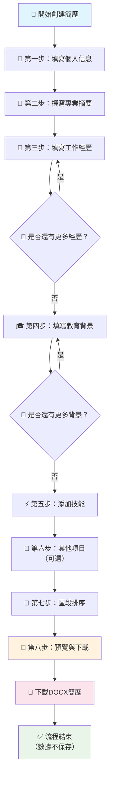

# 📄 我的簡歷生成器 (My Resume Builder)

<div align="center">


**一個免費、簡單易用的專業簡歷生成器**  
*專注於核心功能，讓任何人都能快速創建專業簡歷*

[🚀 開始使用](#🚀-用戶創建流程圖) • [📚 技術文檔](#🏗️-組件架構說明) • [🛠️ 開發指南](#🔍-redux-機制解釋)

</div>

---

## ✨ 核心特色

<table>
<tr>
<td width="50%">

### 🎯 **用戶友好**
- 📱 **響應式設計** - 完美適配手機和桌面
- 🌐 **雙語支持** - 繁體中文 / English
- 🎨 **現代界面** - 簡潔直觀的用戶體驗
- 🔒 **隱私保護** - 數據不保存，完全本地處理

</td>
<td width="50%">

### ⚡ **功能強大**
- 📝 **智能編輯** - 富文本編輯器支持
- 🔄 **靈活排序** - 自定義簡歷區段順序  
- 📎 **自定義區塊** - 添加任意內容區塊
- 📊 **即時預覽** - DOCX格式實時預覽

</td>
</tr>
</table>

---

## 🚀 用戶創建流程圖

<div align="center">



</div>

---

## 📋 各步驟詳細說明

<details>
<summary><strong>👤 第一步：個人信息</strong></summary>

收集最基本的聯繫方式，建立專業形象。

#### 必填欄位 ✅
- 👤 **姓名** - 完整中英文姓名
- 📧 **電子郵件** - 專業信箱地址  
- 📱 **電話號碼** - 主要聯繫電話

#### 可選欄位 ⭐
- 💼 **職業頭銜** - 例如：軟體工程師、行銷專員、應屆畢業生
- 📍 **所在地** - 例如：台北，台灣
- 🌐 **個人網站** - 作品集或個人官網連結
- 💼 **LinkedIn** - 專業社群檔案連結

</details>

<details>
<summary><strong>📝 第二步：專業摘要</strong></summary>

簡歷的「電梯演講」，30秒內說服雇主繼續閱讀。

#### 📋 內容指南
- 📏 **長度建議：** 2-3句話，約50-100字
- 🎯 **重點包含：** 專業背景 + 核心技能 + 職業目標
- ✨ **範例：** 「富有激情的全端工程師，擁有3年構建Web應用經驗，精通JavaScript與Node.js，致力於創造優秀的用戶體驗。」

</details>

<details>
<summary><strong>💼 第三步：工作經歷</strong></summary>

簡歷的核心內容，強調**成就**而非職責。

#### 📝 每個工作經歷包含
- 🏢 **公司名稱** - 完整公司名稱
- 👔 **職位名稱** - 具體職位頭銜  
- 📍 **工作地點** - 城市或地區
- 📅 **任職時間** - 月份/年份選擇器
- ☑️ **目前在職** - 自動設為「至今」
- 📊 **工作職責與成就** - 使用富文本編輯器

#### 💡 撰寫技巧
> 使用條列式說明，以**動詞開頭**，並盡量**量化成就**  
> 例如：「優化資料庫查詢，將頁面加載速度提升15%」

</details>

<details>
<summary><strong>🎓 第四步：教育背景</strong></summary>

展示學術背景和專業培訓經歷。

#### 📚 教育資訊包含
- 🏫 **學校名稱** - 完整院校名稱
- 📖 **所學專業** - 例如：計算機科學、企業管理
- 🎓 **學位等級** - 博士、碩士、學士、副學士、高中
- 📅 **在學時間** - 起始和結束年份
- ⭐ **額外信息**（可選）- 成績、相關課程、學術榮譽

</details>

<details>
<summary><strong>⚡ 第五步：技能管理</strong></summary>

快速展示核心技能和專業能力。

#### ⚡ 智能輸入功能
- 🔤 **批量添加** - 用逗號分隔多個技能
- ⏱️ **經驗年數** - 可選填寫每項技能的使用年數  
- 📱 **響應式顯示** - 手機和桌面端不同的展示方式

#### 💡 技能分類建議
- 💻 **技術技能：** Python, JavaScript, Photoshop
- 🗣️ **語言能力：** 英文流利, 日語N2
- 🤝 **軟技能：** 團隊合作, 專案管理

</details>

<details>
<summary><strong>📎 第六步：其他項目（可選）</strong></summary>

可摺疊區塊設計，補充額外專業資訊。

#### 🏆 包含項目
- **🎨 興趣愛好** - 展示個人特色
- **📜 證書認證** - 專業證書和認證  
- **🌐 語言能力** - 自定義備註（如 JLPT N1、TOEIC 900）
- **✨ 自定義區塊** - 添加任意標題和富文本內容

#### 🎯 自定義區塊特色
> 📝 支援富文本編輯  
> 🔄 無限添加自定義項目  
> 🎨 靈活內容格式

</details>

<details>
<summary><strong>🔄 第七步：區段排序（NEW!）</strong></summary>

全新功能！自定義簡歷各區段的顯示順序。

#### 🎛️ 排序功能
- ⬆️⬇️ **拖拽排序** - 使用箭頭按鈕調整順序
- ✅❌ **啟用/停用** - 彈性控制區段顯示  
- 📱 **即時預覽** - 立即看到排序效果
- 🎯 **智能管理** - 自動處理自定義區塊

</details>

<details>
<summary><strong>👀 第八步：預覽與下載</strong></summary>

最終預覽和文檔生成，完成簡歷創建。

#### 📄 預覽功能
- 🔍 **即時預覽** - DOCX格式實時預覽
- 🌐 **多語言支持** - 繁中/英文版本切換
- 📱 **響應式界面** - 各種裝置完美顯示

#### 💾 下載選項  
- 📄 **DOCX格式** - 一鍵下載Word文檔
- 🔒 **隱私保護** - 所有數據僅本地處理，不會保存

#### 🔐 隱私承諾
> 為保護您的隱私，所有輸入數據均**不會被保存**  
> 請妥善保管生成的文檔檔案

</details>


---

<div align="center">

## 🛠️ 技術架構深度解析

*為開發者和技術愛好者準備的詳細技術文檔*

</div>

---

## 🔍 Redux 機制解釋

### 1. **我們確實在使用Actions！** ✅

<details>
<summary>點擊查看 Redux Actions 運作機制</summary>

我們使用 **Redux Toolkit** 的現代化方法，自動生成 Actions 和 Reducers：

```typescript
// src/store/resumeSlice.ts
const resumeSlice = createSlice({
  name: 'resume',
  initialState,
  reducers: {
    // 自動生成 action creators 和 action types
    updatePersonalInfo: (state, action: PayloadAction<PersonalInfo>) => {
      state.personalInfo = action.payload;
    },
    addSkill: (state, action: PayloadAction<Skill>) => {
      state.skills.push(action.payload);
    }
  }
});

// 自動導出 actions
export const { updatePersonalInfo, addSkill } = resumeSlice.actions;
```

</details>
## 📚 Redux 傳統方式 vs Redux Toolkit

<div align="center">

| 對比項目 | 傳統 Redux ❌ | Redux Toolkit ✅ |
|---------|-------------|-----------------|
| **代碼量** | ~200行 | ~50行 |
| **Action Types** | 手動定義 | 自動生成 |
| **Action Creators** | 手動創建 | 自動生成 |
| **不可變性** | 手動處理 | Immer自動處理 |
| **TypeScript支持** | 需額外配置 | 內建支持 |
| **DevTools** | 需手動設置 | 內建整合 |

</div>

<details>
<summary><strong>🔥 傳統Redux（繁瑣的方式）</strong></summary>

```typescript
// ❌ 大量樣板代碼
// 1. 定義Action Types
const ADD_SKILL = 'ADD_SKILL';
const UPDATE_SKILL = 'UPDATE_SKILL';
const REMOVE_SKILL = 'REMOVE_SKILL';

// 2. 創建Action Creators
const addSkill = (skill: Skill) => ({
  type: ADD_SKILL,
  payload: skill
});

// 3. 創建Reducer
const skillsReducer = (state = [], action) => {
  switch (action.type) {
    case ADD_SKILL:
      return [...state, action.payload]; // 手動不可變更新
    default:
      return state;
  }
};
```

</details>

<details>
<summary><strong>✨ Redux Toolkit（我們的現代化方式）</strong></summary>

```typescript
// ✅ 簡潔且功能強大
const resumeSlice = createSlice({
  name: 'resume',
  initialState,
  reducers: {
    // 自動生成 action creators 和 action types
    addSkill: (state, action: PayloadAction<Skill>) => {
      state.skills.push(action.payload); // 直接修改！Immer處理不可變性
    },
    updateSkill: (state, action: PayloadAction<{ id: string; data: Skill }>) => {
      const index = state.skills.findIndex(skill => skill.id === action.payload.id);
      if (index !== -1) {
        state.skills[index] = action.payload.data;
      }
    }
  }
});

// 自動導出所有 actions
export const { addSkill, updateSkill, removeSkill } = resumeSlice.actions;
```

</details>

## 🔧 實際使用中的Actions

<details>
<summary><strong>查看組件中的Actions使用範例</strong></summary>

```typescript
// src/components/forms/SkillsForm.tsx
import { useAppSelector, useAppDispatch } from '../../hooks/redux';
import { addSkill, updateSkill, removeSkill } from '../../store/resumeSlice';

const SkillsForm: React.FC = () => {
  const skills = useAppSelector(state => state.resume.skills);
  const dispatch = useAppDispatch();

  const addNewSkill = (skillName: string) => {
    const newSkill: Skill = {
      id: generateId(),
      name: skillName.trim(),
      years: undefined
    };
    dispatch(addSkill(newSkill)); // 🎯 使用自動生成的action
  };

  const updateSkillYears = (id: string, years: number | undefined) => {
    const skill = skills.find(s => s.id === id);
    if (skill) {
      dispatch(updateSkill({ id, data: { ...skill, years } }));
    }
  };

  const removeSkillItem = (id: string) => {
    dispatch(removeSkill(id));
  };
};
```

</details>
## 🎯 Redux 工作流程

<div align="center">


</div>

<details>
<summary><strong>🔍 深入了解Action派發流程</strong></summary>

#### 1. **Action被dispatch時：**
```typescript
// 您寫的代碼
dispatch(addSkill(newSkill));

// 實際執行的內容
dispatch({
  type: 'resume/addSkill',  // 🎯 自動生成的type
  payload: newSkill
});
```

#### 2. **Redux DevTools中的顯示：**
```json
{
  "type": "resume/addSkill",
  "payload": {
    "id": "abc123",
    "name": "JavaScript",
    "years": 3
  },
  "timestamp": "10:30:45.123"
}
```

</details>

## 💡 Redux Toolkit 優勢

<div align="center">

### 🚀 **為什麼選擇 Redux Toolkit？**

</div>

<table align="center">
<tr>
<td width="50%">

#### ✅ **Redux Toolkit 優勢**
- 🔄 **自動生成Actions** - 無需手動創建
- 🛡️ **Immer集成** - 直接修改語法，實際不可變
- 📘 **TypeScript完美支持** - 內建類型安全
- 📦 **內置最佳實踐** - DevTools, Thunk 等
- 🎯 **減少90%樣板代碼** - 從200行到50行

</td>
<td width="50%">

#### ❌ **傳統Redux痛點**
- ✋ **大量樣板代碼** - 重複性工作
- 🔧 **手動配置** - Actions, Types, Creators
- 🐛 **容易出錯** - 不可變更新語法
- ⏰ **開發效率低** - 繁瑣的設置過程
- 📝 **TypeScript配置複雜** - 需額外工作

</td>
</tr>
</table>
---

<div align="center">

## 🚀 快速開始指南

</div>

### 📦 安裝與運行

```bash
# 克隆專案
git clone <repository-url>
cd my-resume-builder

# 安裝依賴
npm install

# 啟動開發服務器
npm run dev

# 開啟瀏覽器至 http://localhost:5173
```

### 🔧 開發工具推薦

- **Redux DevTools** - 監控state變化和actions
- **React Developer Tools** - 檢查組件層次和props  
- **VS Code Extensions**：
  - ES7+ React/Redux/React-Native snippets
  - Tailwind CSS IntelliSense
  - TypeScript Importer

---

## 📊 技術總結

<div align="center">

### 🎯 **我們使用現代化的Redux Toolkit！**

**當您調用 `dispatch(addSkill(newSkill))` 時，實際上在dispatch完整的Redux action**  
*Redux Toolkit只是讓這個過程更簡潔和現代化*

</div>

<table align="center">
<tr>
<td align="center">

#### 🔴 **傳統Redux**
❌ 手動創建action types  
❌ 手動創建action creators  
❌ 複雜的reducer邏輯  
❌ 大量樣板代碼  

</td>
<td align="center">

#### 🟢 **Redux Toolkit**
✅ 自動生成actions  
✅ 自動生成action types  
✅ 簡潔的reducer邏輯  
✅ TypeScript完美支持  

</td>
</tr>
</table>

**💡 開發者提示：** 打開瀏覽器的Redux DevTools，您可以看到所有actions的完整運作過程！

---

## 🏗️ 組件架構說明

### 📁 組件目錄結構

```
src/components/
├── common/                 # 共用組件
│   ├── LanguageSwitcher.tsx    # 多語言切換器
│   └── RichTextEditor.tsx      # 富文本編輯器
├── forms/                  # 表單組件
│   ├── PersonalInfoForm.tsx    # 第一步：個人信息表單
│   ├── ProfessionalSummaryForm.tsx  # 第二步：專業摘要表單
│   ├── WorkExperienceForm.tsx  # 第三步：工作經歷表單
│   ├── EducationForm.tsx       # 第四步：教育背景表單
│   ├── SkillsForm.tsx          # 第五步：技能表單
│   ├── OptionalSectionsForm.tsx    # 第六步：可選項目表單
│   └── OrderingForm.tsx        # 第七步：區段排序表單
├── Layout.tsx              # 應用程式布局組件
├── StepIndicator.tsx       # 步驟指示器組件
└── PreviewPage.tsx         # 簡歷預覽頁面
```

### 🧩 核心組件詳解

#### **Layout.tsx** - 應用程式主佈局
```typescript
// 提供統一的頁面佈局結構
- Header：包含標題和語言切換器
- StepIndicator：顯示當前進度（預覽頁除外）
- Main Content：動態內容區域
- Footer：隱私說明
```

#### **StepIndicator.tsx** - 響應式進度指示器
```typescript
// 8個步驟的進度追蹤
步驟流程：個人信息 → 專業摘要 → 工作經歷 → 教育背景 → 技能 → 可選項目 → 區段排序 → 預覽
- 響應式設計：手機垂直佈局，桌面水平佈局
- 視覺狀態：已完成（✓）、進行中、待完成
```

#### **Common Components**

##### **LanguageSwitcher.tsx** - 多語言切換
```typescript
// 支持 English / 繁體中文 切換
- Hover下拉選單設計
- 實時切換界面語言
- 與 i18next 整合
```

##### **RichTextEditor.tsx** - 智能富文本編輯器
```typescript
// 基於 TinyMCE 的增強型編輯器
特色功能：
- 智能貼上處理：自動清理Word格式
- 特殊字符標準化：• → 列表，智能引號等
- <br> → <p> 轉換
- 支持格式：粗體、斜體、底線、列表
- 阻止不必要的console.log輸出
```

### 📝 表單組件系列

每個表單組件都遵循統一的設計模式：

#### **共同特徵**
- **Redux整合**：使用 `useAppSelector` 和 `useAppDispatch`
- **響應式設計**：手機和桌面端適配
- **多語言支持**：完整的i18n整合
- **表單驗證**：實時驗證和錯誤提示
- **導航控制**：上一步/下一步按鈕

#### **個別特色**

1. **PersonalInfoForm** - 個人信息收集
   - 必填欄位：姓名、電郵、電話
   - 可選欄位：職業頭銜、地址、網站、LinkedIn

2. **ProfessionalSummaryForm** - 專業摘要
   - 可選欄位，使用富文本編輯器
   - 提供寫作指引和範例

3. **WorkExperienceForm** - 工作經歷管理
   - 動態添加/刪除經歷
   - 日期選擇器（月/年）
   - "目前在職"選項
   - 富文本責任描述

4. **EducationForm** - 教育背景
   - 多個教育經歷支持
   - 學位選擇器
   - "目前在學"狀態
   - 可選成績/榮譽欄位

5. **SkillsForm** - 技能管理
   - 逗號分隔批量添加
   - 可選年數經驗
   - 響應式表格顯示

6. **OptionalSectionsForm** - 可選項目
   - 摺疊式區塊設計
   - 證書管理
   - 語言能力（自定義備註替代固定級別）
   - **自定義區塊**：用戶可添加任意標題和富文本內容
   - 興趣愛好

7. **OrderingForm** - 區段排序（新增）
   - 拖放式排序（通過上下箭頭）
   - 啟用/停用區段功能
   - 動態包含自定義區塊
   - 實時順序更新

### 🎨 PreviewPage - 文檔預覽與下載

```typescript
// 強大的DOCX預覽和生成系統
核心功能：
- 實時DOCX預覽（基於docx-preview）
- 多語言文檔生成
- 響應式預覽界面
- 一鍵下載Word文檔
- 隱私提示和使用指南
```

### 🔄 數據流架構

```
用戶輸入 → 表單組件 → Redux Actions → Store更新 → 組件重渲染
                                    ↓
預覽頁面 ← DOCX生成器 ← 完整簡歷數據 ← Store
```

### 🎯 響應式設計策略

- **Mobile First**：優先考慮手機體驗
- **Tailwind CSS**：使用 `md:` 等斷點實現響應式
- **StepIndicator**：手機垂直，桌面水平佈局
- **表單**：手機單列，桌面多列佈局
- **PreviewPage**：適配不同螢幕尺寸的預覽

### 💡 技術亮點

1. **TypeScript全面支持**：所有組件都有完整的類型定義
2. **Redux Toolkit**：現代化的狀態管理
3. **React Hook模式**：函數式組件和自定義Hook
4. **國際化（i18n）**：完整的雙語支持
5. **智能表單處理**：動態驗證和用戶體驗優化
6. **富文本編輯**：專業級的內容編輯體驗

---

<div align="center">

## 📚 文檔目錄

</div>

### 🎯 用戶指南
- [✨ 核心特色](#✨-核心特色)
- [🚀 用戶創建流程圖](#🚀-用戶創建流程圖)
- [📋 各步驟詳細說明](#📋-各步驟詳細說明)
- [🚀 快速開始指南](#🚀-快速開始指南)

### 🛠️ 開發者文檔
- [🔍 Redux 機制解釋](#🔍-redux-機制解釋)
- [📚 Redux 傳統方式 vs Redux Toolkit](#📚-redux-傳統方式-vs-redux-toolkit)
- [🎯 Redux 工作流程](#🎯-redux-工作流程)
- [🏗️ 組件架構說明](#🏗️-組件架構說明)

### 📖 技術參考
- [💡 Redux Toolkit 優勢](#💡-redux-toolkit-優勢)
- [📊 技術總結](#📊-技術總結)
- [🔄 數據流架構](#數據流架構)
- [🎯 響應式設計策略](#響應式設計策略)

---

<div align="center">

## 🛠️ 技術棧

- **富文本編輯器：** [HugeRTE](https://github.com/hugerte/hugerte) - MIT 授權的 TinyMCE 替代方案
- **授權：** MIT License

## 🤝 貢獻指南

**歡迎所有形式的貢獻！**

</div>

### 🔧 開發環境設置

```bash
# 1. Fork 並克隆專案
git clone https://github.com/your-username/my-resume-builder.git
cd my-resume-builder

# 2. 安裝依賴
npm install

# 3. 啟動開發模式
npm run dev

# 4. 運行測試（如果有）
npm test
```

### 📝 提交規範

- 🐛 `fix:` 修復bug
- ✨ `feat:` 新功能
- 📚 `docs:` 文檔更新
- 🎨 `style:` 代碼格式調整
- ♻️ `refactor:` 重構代碼
- ⚡ `perf:` 性能優化

### 🎯 貢獻領域

- 🌐 **多語言支持** - 添加更多語言
- 🎨 **UI/UX改進** - 提升用戶體驗
- 📄 **模板擴展** - 新增簡歷模板
- 🔧 **功能增強** - 新功能開發
- 🐛 **Bug修復** - 問題回報和修復
- 📚 **文檔完善** - 改進說明文檔

---

<div align="center">

## 📄 授權協議

**MIT License** - 詳見 [LICENSE](LICENSE) 文件

---

**⭐ 如果這個專案對您有幫助，請給我們一個 Star！**

*感謝所有貢獻者讓這個專案更完善* 💪

</div>