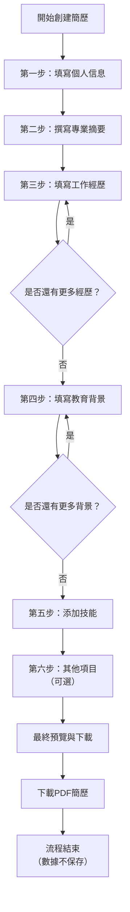

## 核心設計理念

一個免費、簡單易用的簡歷生成器，專注於核心功能，讓用戶能快速創建專業簡歷。

---

## 用戶創建流程圖



---

## 各步驟詳細說明

### 第一步：個人信息

收集最基本的聯繫方式。

- **姓名：** `[文字輸入框]`
- **職業頭銜：** `[文字輸入框]` (例如：軟體工程師、行銷專員、應屆畢業生)
- **電子郵件：** `[郵件輸入框]`
- **電話號碼：** `[電話輸入框]`
- **所在地：** `[文字輸入框]` (例如：台北，台灣)
- **(選填) 個人網站/作品集連結：** `[文字輸入框]`
- **(選填) LinkedIn 個人資料連結：** `[文字輸入框]`

---

### 第二步：專業摘要

簡歷的「電梯演講」，說服雇主繼續閱讀。

- **摘要正文：** `[大型文字輸入區]`
- **引導提示：** 「用2-3句話總結你的專業背景、核心技能和職業目標。例如：『富有激情的全端工程師，擁有3年構建Web應用經驗，精通JavaScript與Node.js。』」

---

### 第三步：工作經歷

簡歷的核心內容，強調成就而非職責。

- **功能：** **「+ 新增工作經歷」** 按鈕。
- **每個條目包含：**
    - **公司名稱：** `[文字輸入框]`
    - **職位名稱：** `[文字輸入框]`
    - **所在城市：** `[文字輸入框]`
    - **起訖時間：** `[月份下拉選單]` - `[年份下拉選單]` **至** `[月份下拉選單]` - `[年份下拉選單]`
        - 包含一個核取方塊 **「我目前在此職位工作」**，勾選後「結束年月」自動變為「至今」。
    - **工作職責與成就：** `[大型文字輸入區]`
        - **提示：** 「使用條列式說明，以動詞開頭，並盡量量化你的成就。例如：『*優化資料庫查詢，將頁面加載速度提升15%。*』」

---

### 第四步：教育背景

- **功能：** **「+ 新增教育經歷」** 按鈕。
- **每個條目包含：**
    - **學校名稱：** `[文字輸入框]`
    - **所學專業：** `[文字輸入框]` (例如：計算機科學、企業管理)
    - **學位：** `[下拉選單]` (選項：博士、碩士、學士、副學士、高中)
    - **在學時間：** `[年份下拉選單]` **至** `[年份下拉選單]`
    - **(選填) 成績、相關課程、榮譽：** `[小型文字輸入區]`

---

### 第五步：技能

快速列出核心技能。

- **功能：** **「+ 添加技能」** 按鈕。
- **輸入方式：** 用戶輸入技能（如 `Python`, `Photoshop`, `英文流利`）後，按Enter鍵或逗號即可生成一個技能標籤。
- **(可選進階) 熟練度：** 在每个技能標籤旁提供下拉選單，選項為：`初學`、`中等`、`熟練`、`專家`。

---

### 第六步：其他項目 (可選)

提供一個可摺疊的區塊，讓用戶補充額外資訊。

- **興趣愛好：** `[文字輸入框]`
- **證書：** `[「+ 新增證書」按鈕]` (證書名稱、頒發機構、取得日期)
- **語言能力：** `[「+ 新增語言」按鈕]` (語言名稱、熟練程度)

---

### 最終步驟：預覽與下載

- **預覽頁面：** 將所有填寫的資訊套用到唯一的模板上，生成最終預覽圖。頁面提供明顯的按鈕讓用戶返回修改任何部分。
- **下載操作：**
    - 一個顯眼的按鈕：**「下載 PDF 簡歷」**。
    - **隱私說明：** 在按鈕下方附上一行說明：「為保護您的隱私，您的所有輸入數據均**不會被保存**。請妥善保管生成的PDF文件。」這明確了免費和隱私友好的立場，並能減少用戶的疑慮。


很好的問題！讓我詳細解釋Redux在這個項目中的機制，以及為什麼我們使用Redux Toolkit而不是傳統的Redux。


## 🔍 Redux 機制解釋

### 1. **我們確實在使用Actions！**

讓我展示給您看：
Read file: src/store/resumeSlice.ts
Read file: src/store/resumeSlice.ts
## 📚 Redux 傳統方式 vs Redux Toolkit

### **傳統Redux（繁瑣的方式）：**

```typescript
// 1. 定義Action Types
const ADD_SKILL = 'ADD_SKILL';
const UPDATE_SKILL = 'UPDATE_SKILL';
const REMOVE_SKILL = 'REMOVE_SKILL';

// 2. 創建Action Creators
const addSkill = (skill: Skill) => ({
  type: ADD_SKILL,
  payload: skill
});

const updateSkill = (id: string, data: Skill) => ({
  type: UPDATE_SKILL,
  payload: { id, data }
});

// 3. 創建Reducer
const skillsReducer = (state = [], action) => {
  switch (action.type) {
    case ADD_SKILL:
      return [...state, action.payload];
    case UPDATE_SKILL:
      return state.map(skill => 
        skill.id === action.payload.id 
          ? action.payload.data 
          : skill
      );
    case REMOVE_SKILL:
      return state.filter(skill => skill.id !== action.payload);
    default:
      return state;
  }
};
```

### **Redux Toolkit（我們使用的方式）：**

```typescript
const resumeSlice = createSlice({
  name: 'resume',
  initialState,
  reducers: {
    // Redux Toolkit自動生成action creators和action types！
    addSkill: (state, action: PayloadAction<Skill>) => {
      state.skills.push(action.payload); // 可以直接修改！（Immer處理不可變性）
    },
    
    updateSkill: (state, action: PayloadAction<{ id: string; data: Skill }>) => {
      const index = state.skills.findIndex(skill => skill.id === action.payload.id);
      if (index !== -1) {
        state.skills[index] = action.payload.data;
      }
    }
  }
});

// 自動生成的actions！
export const { addSkill, updateSkill, removeSkill } = resumeSlice.actions;
```

## 🔧 實際使用中的Actions

讓我展示在組件中如何使用這些actions：
Read file: src/components/forms/SkillsForm.tsx
Read file: src/components/forms/SkillsForm.tsx
## 🎯 Redux 工作流程

### 1. **Action被dispatch時發生什麼：**

```typescript
dispatch(addSkill(newSkill));
```

這實際上相當於：
```typescript
dispatch({
  type: 'resume/addSkill',  // 自動生成的type
  payload: newSkill
});
```

### 2. **Redux DevTools中看到的：**

打開瀏覽器的Redux DevTools，您會看到：

```
Action: resume/addSkill @ 10:30:45.123
Payload: {
  id: "abc123",
  name: "JavaScript",
  level: "Intermediate"
}
```

### 3. **完整的數據流：**

```
用戶輸入 → dispatch(action) → reducer更新state → 組件重新渲染
```

## 💡 Redux Toolkit的優勢

### **我們為什麼使用Redux Toolkit：**

1. **自動生成Actions** - 不需要手動創建action types和creators
2. **Immer集成** - 可以寫"可變"代碼，實際上是不可變的
3. **TypeScript支持** - 完整的類型安全
4. **更少的樣板代碼** - 減少90%的重複代碼
5. **內置最佳實踐** - 包含thunk、devtools等

### **對比代碼量：**

**傳統Redux：** ~200行代碼
**Redux Toolkit：** ~50行代碼

達到相同的功能！

## 🔍 查看實際的Actions

讓我在終端中啟動應用程式，您可以在Redux DevTools中看到所有的actions：
Ran tool
## 📊 總結

**我們確實在使用Actions！** 只是Redux Toolkit讓它們更簡潔：

### **傳統Redux：**
- ❌ 手動創建action types
- ❌ 手動創建action creators  
- ❌ 複雜的reducer邏輯
- ❌ 大量樣板代碼

### **Redux Toolkit（我們的方式）：**
- ✅ 自動生成actions：`addSkill`, `updateSkill`, `removeSkill`
- ✅ 自動生成action types：`'resume/addSkill'`
- ✅ 簡潔的reducer邏輯
- ✅ TypeScript類型安全
- ✅ 內置不可變性（Immer）

**當您調用 `dispatch(addSkill(newSkill))` 時，您實際上在dispatch一個完整的Redux action！** Redux Toolkit只是讓這個過程更簡潔和現代化。

您可以在瀏覽器的Redux DevTools中看到所有這些actions的完整詳情！