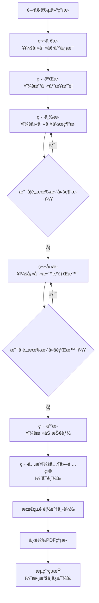

## 核心設計ç†å¿µ

一個å…è²»ã€ç°¡å–®æ˜“用的簡歷生æˆå™¨ï¼Œå°ˆæ³¨æ–¼æ ¸å¿ƒåŠŸèƒ½ï¼Œè®“用戶能快速創建專業簡歷。

---

## 用戶創建æµç¨‹åœ–



---

## å„步驟詳細說æ˜

### 第一步：個人信æ¯

收集最基本的è¯ç¹«æ–¹å¼ã€‚

- **姓å：** `[文字輸入框]`
- **è·æ¥­é ­éŠœï¼š** `[文字輸入框]` (例如：軟體工程師ã€è¡ŒéŠ·å°ˆå“¡ã€æ‡‰å±†ç•¢æ¥­ç”Ÿ)
- **é›»å­éƒµä»¶ï¼š** `[郵件輸入框]`
- **電話號碼：** `[電話輸入框]`
- **所在地：** `[文字輸入框]` (例如：å°åŒ—，å°ç£)
- **(é¸å¡«) 個人網站/作å“集連çµï¼š** `[文字輸入框]`
- **(é¸å¡«) LinkedIn 個人資料連çµï¼š** `[文字輸入框]`

---

### 第二步：專業摘è¦

簡歷的「電梯演講ã€ï¼Œèªªæœé›‡ä¸»ç¹¼çºŒé–±è®€ã€‚

- **摘è¦æ­£æ–‡ï¼š** `[大å‹æ–‡å­—輸入å€]`
- **引å°æ示：** 「用2-3å¥è©±ç¸½çµä½ çš„專業背景ã€æ ¸å¿ƒæŠ€èƒ½å’Œè·æ¥­ç›®æ¨™ã€‚例如：ã€å¯Œæœ‰æ¿€æƒ…的全端工程師，æ“有3年構建Web應用經驗，精通JavaScript與Node.js。ã€ã€

---

### 第三步：工作經歷

簡歷的核心內容，強調æˆå°±è€Œéè·è²¬ã€‚

- **功能：** **「+ æ–°å¢å·¥ä½œç¶“æ­·ã€** 按鈕。
- **æ¯å€‹æ¢ç›®åŒ…å«ï¼š**
    - **å…¬å¸å稱：** `[文字輸入框]`
    - **è·ä½å稱：** `[文字輸入框]`
    - **所在åŸå¸‚：** `[文字輸入框]`
    - **起訖時間：** `[月份下拉é¸å–®]` - `[年份下拉é¸å–®]` **至** `[月份下拉é¸å–®]` - `[年份下拉é¸å–®]`
        - 包å«ä¸€å€‹æ ¸å–方塊 **「我目å‰åœ¨æ­¤è·ä½å·¥ä½œã€**，勾é¸å¾Œã€ŒçµæŸå¹´æœˆã€è‡ªå‹•è®Šç‚ºã€Œè‡³ä»Šã€ã€‚
    - **工作è·è²¬èˆ‡æˆå°±ï¼š** `[大å‹æ–‡å­—輸入å€]`
        - **æ示：** 「使用æ¢åˆ—å¼èªªæ˜ï¼Œä»¥å‹•è©é–‹é ­ï¼Œä¸¦ç›¡é‡é‡åŒ–ä½ çš„æˆå°±ã€‚例如：ã€*優化資料庫查詢，將é é¢åŠ è¼‰é€Ÿåº¦æå‡15%。*ã€ã€

---

### 第四步：教育背景

- **功能：** **「+ æ–°å¢æ•™è‚²ç¶“æ­·ã€** 按鈕。
- **æ¯å€‹æ¢ç›®åŒ…å«ï¼š**
    - **學校å稱：** `[文字輸入框]`
    - **所學專業：** `[文字輸入框]` (例如：計算機科學ã€ä¼æ¥­ç®¡ç†)
    - **å­¸ä½ï¼š** `[下拉é¸å–®]` (é¸é …：åšå£«ã€ç¢©å£«ã€å­¸å£«ã€å‰¯å­¸å£«ã€é«˜ä¸­)
    - **在學時間：** `[年份下拉é¸å–®]` **至** `[年份下拉é¸å–®]`
    - **(é¸å¡«) æˆç¸¾ã€ç›¸é—œèª²ç¨‹ã€æ¦®è­½ï¼š** `[å°å‹æ–‡å­—輸入å€]`

---

### 第五步：技能

快速列出核心技能。

- **功能：** **「+ 添加技能ã€** 按鈕。
- **輸入方å¼ï¼š** 用戶輸入技能（如 `Python`, `Photoshop`, `英文æµåˆ©`）後，按Enteréµæˆ–逗號å³å¯ç”Ÿæˆä¸€å€‹æŠ€èƒ½æ¨™ç±¤ã€‚
- **(å¯é¸é€²éš) 熟練度：** 在æ¯ä¸ªæŠ€èƒ½æ¨™ç±¤æ—æ供下拉é¸å–®ï¼Œé¸é …為：`åˆå­¸`ã€`中等`ã€`熟練`ã€`專家`。

---

### 第六步：其他項目 (å¯é¸)

æ供一個å¯æ‘ºç–Šçš„å€å¡Šï¼Œè®“用戶補充é¡å¤–資訊。

- **興趣愛好：** `[文字輸入框]`
- **證書：** `[「+ æ–°å¢è­‰æ›¸ã€æŒ‰éˆ•]` (證書å稱ã€é ’發機構ã€å–得日期)
- **èªè¨€èƒ½åŠ›ï¼š** `[「+ æ–°å¢èªè¨€ã€æŒ‰éˆ•]` (èªè¨€å稱ã€ç†Ÿç·´ç¨‹åº¦)

---

### 最終步驟：é è¦½èˆ‡ä¸‹è¼‰

- **é è¦½é é¢ï¼š** 將所有填寫的資訊套用到唯一的模æ¿ä¸Šï¼Œç”Ÿæˆæœ€çµ‚é è¦½åœ–。é é¢æä¾›æ˜é¡¯çš„按鈕讓用戶返å›ä¿®æ”¹ä»»ä½•éƒ¨åˆ†ã€‚
- **下載æ“作：**
    - 一個顯眼的按鈕：**「下載 PDF ç°¡æ­·ã€**。
    - **éš±ç§èªªæ˜ï¼š** 在按鈕下方附上一行說æ˜ï¼šã€Œç‚ºä¿è­·æ‚¨çš„éš±ç§ï¼Œæ‚¨çš„所有輸入數據å‡**ä¸æœƒè¢«ä¿å­˜**。請妥善ä¿ç®¡ç”Ÿæˆçš„PDF文件。ã€é€™æ˜ç¢ºäº†å…費和隱ç§å‹å¥½çš„立場，並能減少用戶的疑慮。


很好的å•é¡Œï¼è®“我詳細解釋Redux在這個項目中的機制，以åŠç‚ºä»€éº¼æˆ‘們使用Redux Toolkit而ä¸æ˜¯å‚³çµ±çš„Redux。


## 🔠Redux 機制解釋

### 1. **我們確實在使用Actionsï¼**

讓我展示給您看：
Read file: src/store/resumeSlice.ts
Read file: src/store/resumeSlice.ts
## 📚 Redux å‚³çµ±æ–¹å¼ vs Redux Toolkit

### **傳統Redux（ç¹ç‘£çš„æ–¹å¼ï¼‰ï¼š**

```typescript
// 1. 定義Action Types
const ADD_SKILL = 'ADD_SKILL';
const UPDATE_SKILL = 'UPDATE_SKILL';
const REMOVE_SKILL = 'REMOVE_SKILL';

// 2. 創建Action Creators
const addSkill = (skill: Skill) => ({
  type: ADD_SKILL,
  payload: skill
});

const updateSkill = (id: string, data: Skill) => ({
  type: UPDATE_SKILL,
  payload: { id, data }
});

// 3. 創建Reducer
const skillsReducer = (state = [], action) => {
  switch (action.type) {
    case ADD_SKILL:
      return [...state, action.payload];
    case UPDATE_SKILL:
      return state.map(skill => 
        skill.id === action.payload.id 
          ? action.payload.data 
          : skill
      );
    case REMOVE_SKILL:
      return state.filter(skill => skill.id !== action.payload);
    default:
      return state;
  }
};
```

### **Redux Toolkit（我們使用的方å¼ï¼‰ï¼š**

```typescript
const resumeSlice = createSlice({
  name: 'resume',
  initialState,
  reducers: {
    // Redux Toolkit自動生æˆaction creatorså’Œaction typesï¼
    addSkill: (state, action: PayloadAction<Skill>) => {
      state.skills.push(action.payload); // å¯ä»¥ç›´æ¥ä¿®æ”¹ï¼ï¼ˆImmer處ç†ä¸å¯è®Šæ€§ï¼‰
    },
    
    updateSkill: (state, action: PayloadAction<{ id: string; data: Skill }>) => {
      const index = state.skills.findIndex(skill => skill.id === action.payload.id);
      if (index !== -1) {
        state.skills[index] = action.payload.data;
      }
    }
  }
});

// 自動生æˆçš„actionsï¼
export const { addSkill, updateSkill, removeSkill } = resumeSlice.actions;
```

## 🔧 實際使用中的Actions

讓我展示在組件中如何使用這些actions：
Read file: src/components/forms/SkillsForm.tsx
Read file: src/components/forms/SkillsForm.tsx
## 🯠Redux 工作æµç¨‹

### 1. **Action被dispatch時發生什麼：**

```typescript
dispatch(addSkill(newSkill));
```

這實際上相當於：
```typescript
dispatch({
  type: 'resume/addSkill',  // 自動生æˆçš„type
  payload: newSkill
});
```

### 2. **Redux DevTools中看到的：**

打開ç€è¦½å™¨çš„Redux DevTools，您會看到：

```
Action: resume/addSkill @ 10:30:45.123
Payload: {
  id: "abc123",
  name: "JavaScript",
  level: "Intermediate"
}
```

### 3. **完整的數據æµï¼š**

```
用戶輸入 → dispatch(action) → reduceræ›´æ–°state → 組件é‡æ–°æ¸²æŸ“
```

## 💡 Redux Toolkit的優勢

### **我們為什麼使用Redux Toolkit：**

1. **自動生æˆActions** - ä¸éœ€è¦æ‰‹å‹•å‰µå»ºaction typeså’Œcreators
2. **Immer集æˆ** - å¯ä»¥å¯«"å¯è®Š"代碼，實際上是ä¸å¯è®Šçš„
3. **TypeScript支æŒ** - 完整的é¡å‹å®‰å…¨
4. **更少的樣æ¿ä»£ç¢¼** - 減少90%çš„é‡è¤‡ä»£ç¢¼
5. **內置最佳實è¸** - 包å«thunkã€devtoolsç­‰

### **å°æ¯”代碼é‡ï¼š**

**傳統Redux：** ~200行代碼
**Redux Toolkit：** ~50行代碼

é”到相åŒçš„功能ï¼

## 🔠查看實際的Actions

讓我在終端中啟動應用程å¼ï¼Œæ‚¨å¯ä»¥åœ¨Redux DevTools中看到所有的actions：
Ran tool
## 📊 總çµ

**我們確實在使用Actionsï¼** åªæ˜¯Redux Toolkit讓它們更簡潔：

### **傳統Redux：**
- ⌠手動創建action types
- ⌠手動創建action creators  
- ⌠複雜的reduceré‚輯
- ⌠大é‡æ¨£æ¿ä»£ç¢¼

### **Redux Toolkit（我們的方å¼ï¼‰ï¼š**
- ✅ 自動生æˆactions：`addSkill`, `updateSkill`, `removeSkill`
- ✅ 自動生æˆaction types：`'resume/addSkill'`
- ✅ 簡潔的reduceré‚輯
- ✅ TypeScripté¡å‹å®‰å…¨
- ✅ 內置ä¸å¯è®Šæ€§ï¼ˆImmer）

**當您調用 `dispatch(addSkill(newSkill))` 時，您實際上在dispatch一個完整的Redux actionï¼** Redux Toolkitåªæ˜¯è®“這個é程更簡潔和ç¾ä»£åŒ–。

您å¯ä»¥åœ¨ç€è¦½å™¨çš„Redux DevTools中看到所有這些actions的完整詳情ï¼